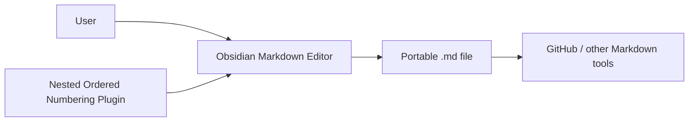
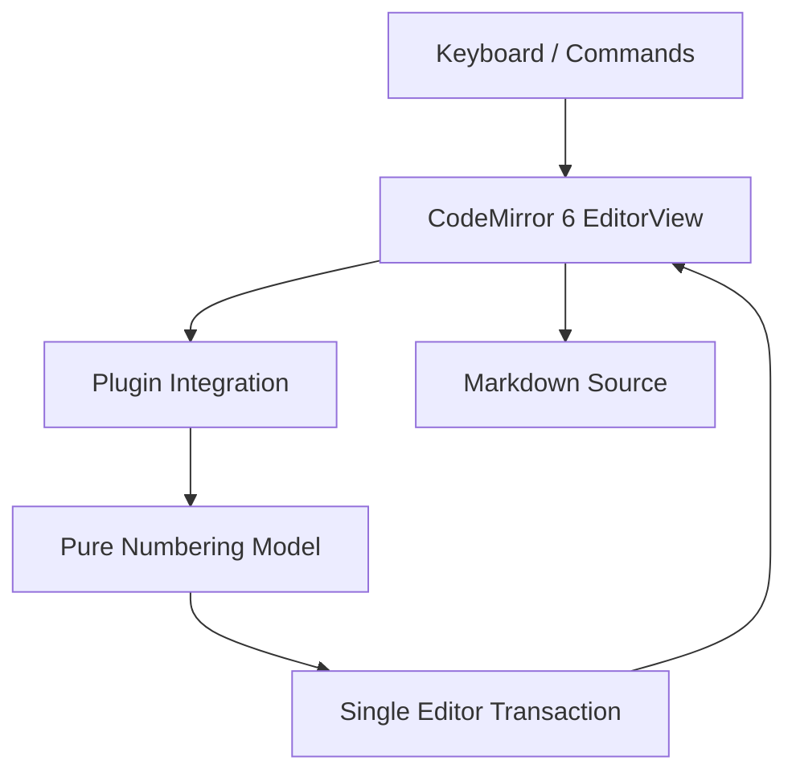
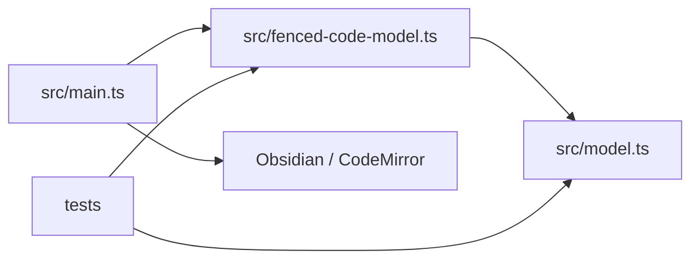
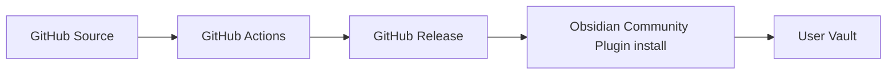

# ARCH

**Project:** Nested Ordered Numbering  
**Baseline:** 0.0.0  
**Status:** Draft — product baseline fixed at 0.3.5; independent QGate pending  
**Source Requirements:** `SWE1.md`  
**Process Ledger:** `SWE2.md`  
**Quality Gate:** `docs/ARCH_QGate.md`  
**Product Source Baseline:** `0.3.5@e6654beb615669173b108917f8e2b99d8d5b64db`  
**Restored Main:** `dc8e5c2cd86ef7bb60d1f4179d3bb58ced250499`  
**Last Updated:** 2026-09-14

## 1. Introduction and Goals
**Status:** REQUIRED

### 1.1. Requirements Overview
Nested Ordered Numbering is an Obsidian Community Plugin for editing hierarchical plain-text numbering such as `1.`, `1.1.`, `1.1.1.` while keeping the complete numbering prefix in the Markdown source itself.

Primary capabilities:
- recognize hierarchical decimal prefixes with a required trailing period and following whitespace;
- Enter creates the next sibling item;
- Tab / Shift+Tab move an item or subtree one hierarchy level;
- insert, delete, and renumber commands operate on numbered blocks;
- blank lines may remain inside one numbered block;
- fenced code blocks are inert to the plugin;
- one logical editor operation is one transaction so one Ctrl+Z reverts it.

### 1.2. Quality Goals
| Priority | Quality Goal | Target |
|---:|---|---|
| 1 | Source portability | Complete hierarchy prefix remains plain Markdown text; no hidden or renderer-specific source mutation |
| 2 | Deterministic numbering | Same text + selection gives the same transform result |
| 3 | Regression resistance | Confirmed numbering defects are locked by automated tests |
| 4 | Recoverability | Git baseline plus atomic editor transaction provide project/user rollback |
| 5 | Offline behavior | Runtime uses no network, telemetry, account, payment, or cloud dependency |

### 1.3. Stakeholders
| Stakeholder / Role | Concern | Authority |
|---|---|---|
| User / project owner | predictable numbering, portable Markdown, stable Community Plugin | final product/baseline authority |
| Implementation | correct TypeScript/CodeMirror implementation | code changes within baselined requirements |
| Verification | tests and manual Vault verification | PASS/FAIL evidence |
| Obsidian Community directory | package/policy compatibility | publication gate |

## 2. Constraints
**Status:** REQUIRED

### 2.1. Technical Constraints
- Obsidian plugin using CodeMirror 6.
- TypeScript source bundled by esbuild into CommonJS `main.js`.
- Minimum Obsidian app version: `1.5.0`.
- Node.js `>=22.13`, pnpm 11.
- Runtime is local-only.
- Product source stores numbering directly in Markdown text.

### 2.2. Process Constraints
- Public repository: `spark00000/NestedOrderedNumbering`.
- Stable product release is `0.3.5`.
- Test order: `pnpm test` → `pnpm lint` → `pnpm build` → `pnpm release:check`.
- Changes require recoverable Git state before mutation.
- Failed or unverified experimental work must not become a product baseline.

### 2.3. Portability Constraint
The source Markdown must remain readable outside Obsidian, including GitHub README/Wiki rendering, without requiring the plugin. The project therefore does not insert backslash escapes, NBSP/zero-width characters, HTML, or renderer-specific source mutations merely to force visual hanging indentation.

## 3. Context and Scope
**Status:** REQUIRED

### 3.1. Business Context

The plugin owns editing semantics only. The `.md` file remains the durable interoperability boundary.

### 3.2. Technical Context

### 3.3. External Interfaces
| Interface ID | Partner | Direction | Format / API | Ownership |
|---|---|---|---|---|
| IF-001 | Obsidian editor | bidirectional | Editor / MarkdownView APIs | Obsidian |
| IF-002 | CodeMirror 6 | bidirectional | keymap, selection, decoration | CodeMirror |
| IF-003 | Markdown file | output/state | UTF-8 plain text | User/Vault |
| IF-004 | GitHub Releases | deployment | `main.js`, `manifest.json`, `styles.css` | Project release |

## 4. Solution Strategy
**Status:** REQUIRED

| Strategy ID | Driver | Strategy | Trade-off |
|---|---|---|---|
| STR-001 | deterministic editing | keep numbering transforms in pure text-model functions | editor integration must translate positions carefully |
| STR-002 | portable Markdown | store complete prefixes directly in source | compound prefixes are not native Markdown ordered-list markers |
| STR-003 | predictable undo | apply one user operation as one editor transaction | transformation may cover a larger numbered block |
| STR-004 | code safety | mask fenced-code regions before transform/decorate | parser must correctly identify fences |
| STR-005 | stability over cosmetic alignment | keep 0.3.5 visual compatibility behavior and do not force compound-prefix hanging indent | wrapped nested continuation may not align like a native Markdown list |

## 5. Building Block View
**Status:** REQUIRED

| Block | Responsibility |
|---|---|
| `src/model.ts` | parse numbered lines; renumber; indent/outdent; Enter/insert/delete transforms |
| `src/fenced-code-model.ts` | fence-aware wrapper around core transforms |
| `src/main.ts` | Obsidian/CodeMirror integration, key interception, commands, transaction application |
| `styles.css` | minimal 0.3.5 compatibility styling for plugin-recognized lines; not a compound-prefix hanging-indent engine |
| tests | pure transform regression tests and Markdown vectors |

## 6. Runtime View
**Status:** REQUIRED

### 6.1. Enter
1. Key event reaches the highest-priority plugin keymap/capture handler.
2. If the cursor is inside a fenced code block, plugin returns without transforming.
3. Core transform parses the current numbered item.
4. Content item creates the next same-depth sibling; prefix-only item exits numbering to one blank line.
5. Related block is renumbered.
6. One editor transaction updates text and selection.

### 6.2. Tab / Shift+Tab
1. Validate numbered item/selection and hierarchy context.
2. Tab requires a valid prior sibling at the relevant depth.
3. Move selected item plus descendants by one hierarchy level.
4. Renumber affected block.
5. Apply as one transaction.

### 6.3. Fenced code
Fenced regions are identified before numbered-line processing. Number-like text inside the fence is preserved as code and must not invoke plugin numbering behavior.

## 7. Deployment View
**Status:** REQUIRED

Release installation unit:
- `main.js`
- `manifest.json`
- `styles.css`

Current stable product release: `0.3.5`.

Documentation-only changes after restoring the 0.3.5 runtime/source tree do not require a new marketplace product release.

## 8. Cross-cutting Concepts
**Status:** REQUIRED

### 8.1. Numbering format
Recognized prefix grammar is conceptually:
`leading whitespace + decimal segments separated by periods + trailing period + whitespace + content`.

Examples:
- `1. text`
- `  1.1. text`
- `    1.1.1. text`

### 8.2. Indentation
Normalized hierarchy indentation uses two raw spaces per depth. Indentation is source data used by the plugin's hierarchy model.

### 8.3. Markdown portability
Compound prefixes such as `1.1.` are intentionally plain text from the perspective of standard Markdown. The plugin does not attempt to redefine the Markdown parser.

### 8.4. Security / privacy
No runtime network, account, telemetry, analytics, payment, or external data store.

### 8.5. Recovery
- Project recovery: Git commit/ref/tag.
- User edit recovery: one Ctrl+Z for one plugin operation.

## 9. Architecture Decisions
**Status:** REQUIRED

| ADR ID | Status | Decision | Rationale / Trade-off |
|---|---|---|---|
| ADR-001 | Accepted | Store full hierarchical prefix in Markdown source | portability and transparency outweigh native Markdown-list semantics |
| ADR-002 | Accepted | Use two raw spaces per hierarchy depth | deterministic compact source format |
| ADR-003 | Accepted | Keep numbering core testable without Obsidian runtime | enables deterministic regression tests |
| ADR-004 | Accepted | Apply editor operations atomically | predictable Ctrl+Z |
| ADR-005 | Accepted | Fenced code is completely inert to plugin numbering | code must not be rewritten |
| ADR-006 | Accepted | Runtime remains local-only | privacy and Community Plugin simplicity |
| ADR-007 | Accepted | Release as three artifacts (`main.js`, `manifest.json`, `styles.css`) | Obsidian Community Plugin packaging |
| ADR-008 | Accepted | Preserve 0.3.5 minimal Live Preview compatibility behavior | it is the last validated stable runtime/source release |
| ADR-009 | Accepted | Do not implement renderer-specific hanging-indent correction for compound prefixes | `1.1.` etc. are not standard Markdown list markers; experiments caused visual regressions and source portability has priority |

## 10. Quality Requirements
**Status:** REQUIRED

| Quality ID | Scenario | Expected Response / Measure |
|---|---|---|
| QS-001 | Enter on content item | one same-depth sibling; one transaction |
| QS-002 | Enter on prefix-only item | numbering removed; exactly one blank line |
| QS-003 | Tab/Shift+Tab | subtree moves one valid level; affected block renumbered |
| QS-004 | edit inside fenced code | plugin no-op |
| QS-005 | build gate | test/lint/build/release-check all pass before product release |
| QS-006 | open `.md` outside Obsidian | complete prefixes remain readable without plugin-specific source encoding |
| QS-007 | wrapped compound prefix | no guarantee of native hanging-indent alignment; must not justify source mutation or unstable renderer hacks |

## 11. Risks and Technical Debt
**Status:** REQUIRED

| ID | Description | Impact | Mitigation / Acceptance | Revisit Trigger |
|---|---|---|---|---|
| RISK-001 | Obsidian/CodeMirror internal DOM/classes may change | visual compatibility can regress | keep styling minimal; manual compatibility test | Obsidian update breaks 0.3.5 behavior |
| RISK-002 | `isDesktopOnly:false` without dedicated mobile evidence | mobile behavior uncertain | retain as deferred verification | mobile support decision/test |
| RISK-003 | compound prefix wrapped continuation does not receive native Markdown hanging indent | cosmetic alignment differs from `1.`/`10.` lists | accepted Known Limitation; preserve portable source | standard portable solution appears without source mutation |
| RISK-004 | experimental visual corrections can destabilize hierarchy rendering | parent/child jump, marker/body split, doubled offset | do not revive v1-v8 hanging-indent design without new architecture/evidence | explicit approved redesign with real integration test |

## 12. Glossary
**Status:** REQUIRED

| Term | Definition |
|---|---|
| compound prefix | hierarchical prefix containing multiple numeric segments, e.g. `1.1.` |
| root prefix | one-segment prefix such as `1.` or `10.` |
| numbered block | contiguous logical group of plugin-recognized numbered items, optionally containing allowed blank/fenced regions |
| hanging indent | continuation lines visually starting under the first content character rather than the number |
| source portability | `.md` remains understandable outside Obsidian without plugin-specific source encoding |
| stable product baseline | `0.3.5@e6654beb615669173b108917f8e2b99d8d5b64db` |

## 13. Agent Role and Orchestration View
**Status:** REQUIRED

| Activity | Human | Architecture | Architecture Peer | Implementation | Verification / Release |
|---|---:|---:|---:|---:|---:|
| product intent / portability policy | A | R | C | I | I |
| architecture contract | C | R | A/QG | I | C |
| source implementation | I | C | I | R | C |
| test / regression evidence | I | C | I | C | R |
| marketplace release | A | I | I | C | R |

Final architecture acceptance requires an independent Architecture Peer review using `docs/ARCH_QGate.md`.

## Baseline Handoff
- Product runtime/source is restored to the existing 0.3.5 release tree.
- PR #16 and the v1-v8 hanging-indent experiments are not part of the accepted product baseline.
- Compound-prefix wrapped hanging-indent is a documented Known Limitation, not an open product defect.
- Future implementation agents must not reintroduce renderer-specific hanging-indent workarounds without an explicit architecture change and a portability-preserving solution.
- `docs/ARCH_QGate.md` remains the quality-gate instance for this Architecture Contract.
